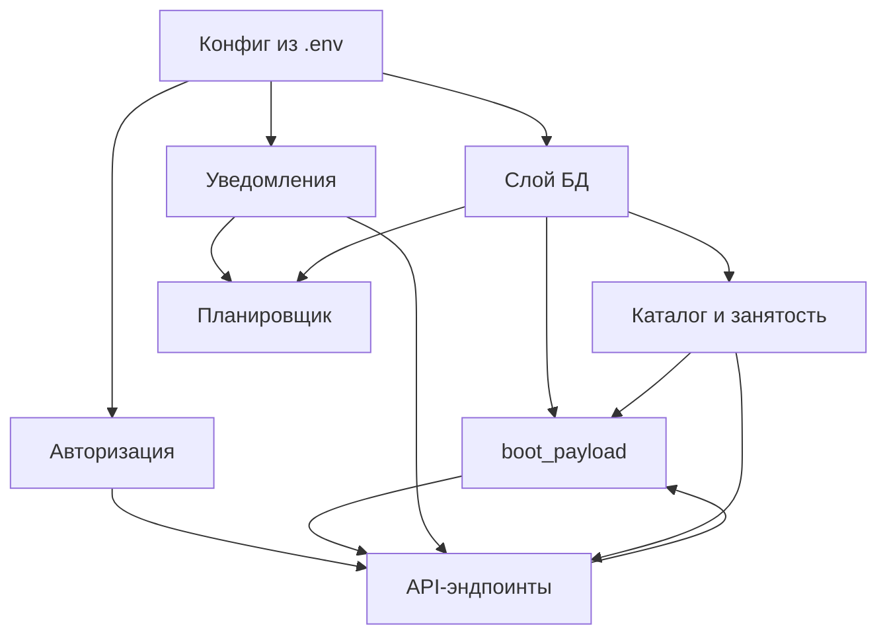

# 🗺️ Карта кода бота (`bot/main.py`)

Точка входа во всю документацию по бэкенду. Весь бэкенд — **один файл** `bot/main.py` (~1729 строк): aiohttp (API + статика) + aiogram (бот) + SQLite + планировщик, всё в одном процессе.

> [!info] Как читать
> Каждая заметка = один слой кода. Стрелки в схеме ниже = «кто от кого зависит». Иди сверху вниз: конфиг → БД → домен → API → бот.

## Слои

> [!tip] Обзорная таблица всех заметок
> Открой [[Оборудыш.base]] — база со всеми заметками, сгруппированными по части (Бэкенд / Фронтенд / Гайд).

## Заметки — бэкенд (`bot/main.py`)

- [[Внешние зависимости]] — какие библиотеки и зачем (aiogram, aiohttp, dotenv, sqlite3, stdlib).
- [[Конфиг и запуск]] — переменные `.env`, функция `main()`, порядок инициализации.
- [[Слой БД]] — таблицы, `db()`, `init_db()`, `_migrate()`.
- [[Каталог и занятость]] — `TOTALS`, `busy_map`, `check_availability`, календарь.
- [[Авторизация]] — подпись Telegram, декоратор `@auth`.
- [[boot_payload — сборка ответа]] — центральная функция, `shape_req`, чат, непрочитанное.
- [[API-эндпоинты]] — все `/api/...`, главный `api_req_action`.
- [[Уведомления и карточки]] — `notify`, `send_or_update_card`, фото.
- [[Планировщик]] — `run_checks`, напоминания, автоотмены, сводки, бэкап.
- [[Поток заявки]] — жизненный цикл заявки от `new` до `closed`.

## Заметки — фронтенд (`prototype/index.html`)

- [[Фронтенд — карта]] — обзор, два режима, точка входа.
- [[Фронтенд — режимы и запуск]] — SRV vs моки, `IN_TG`, `bootApp`, поллинг, тема.
- [[Фронтенд — навигация и render]] — `stack`, `SCREENS`, `render()`.
- [[Фронтенд — экраны]] — таблица всех экранов.
- [[Фронтенд — каталог, мастер, фото]] — каталог, мастер заявки, сжатие фото, доступы.
- [[Фронтенд — стили и токены]] — CSS-токены, тёмная тема, иконки, ловушки.

## Данные и общие схемы

- [[Данные — каталог и списки]] — `catalog.js`, `org_members.csv`, Google-таблица MB, фото позиций.
- [[Полный цикл — запроса]] — большая схема: как одно нажатие проходит фронт → API → БД → уведомление.

## Дальше

- [[Гайд — куда развивать]] — роадмап: что добить перед продом, что улучшить, что добавить, рецепты правок.
- [[Гайд — 4 правки с промтами]] — конкретные задачи (админ дня, завтра+куратор, кнопка пересверки, автоотделы по нику) + готовые промты для нейронки.
- [[Гайд — стилизация бота в Telegram]] — оформление в @BotFather: имя, описание, команды + промты для текста и генерации аватара/превью.
- [[Промт — запуск нейронки на правки]] — мастер-промт: ассистент изучает контекст, делает правки+фичи, проверяет в DEV.

## Правило «где править»

| Хочу | Иду в |
|---|---|
| Новое поле у заявки на фронте | [[boot_payload — сборка ответа]] → `shape_req` |
| Новое действие по заявке | [[API-эндпоинты]] → `api_req_action` |
| Новую колонку в БД | [[Слой БД]] → `init_db` + `_migrate` |
| Пороги напоминаний | [[Планировщик]] → `run_checks` |
| Правила дат/занятости | [[Каталог и занятость]] |

> [!warning] Деплой
> Правил `main.py` → **перезапуск бота**. Правил `prototype/*` → нет (статика). Новая колонка → обязательно в `_migrate`, иначе прод-база упадёт.
