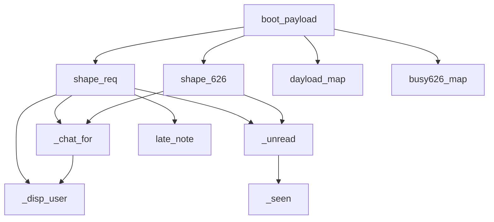

# 🧩 boot_payload — сборка ответа фронту

Центральная функция ([строка 465](../bot/main.py)). **Почти каждый мутирующий эндпоинт заканчивается `return web.json_response(boot_payload(uid))`.** Фронт заливает результат через `applyBoot`. Зависит от [[Слой БД]] и [[Каталог и занятость]].

> [!important] Главная идея архитектуры
> Сервер не шлёт мелкие дельты. После любого действия он собирает **весь текущий снимок** для этого пользователя и отдаёт целиком. Фронт просто перерисовывается. Проще, но каждый ответ «тяжёлый».

## Что внутри payload

| Поле | Что |
|---|---|
| `isAdmin` / `isSenior` | права |
| `registered` / `verified` / `blockReason` | статус профиля |
| `requests` | заявки (юзер — свои, админ — все) через `shape_req` |
| `bookings626` | брони через `shape_626` |
| `dayload` / `busy626` | подсветка календаря/слотов |
| `extraItems` / `catBlocks` / `removedItems` | каталог с правками |
| `favSets` | избранные наборы |
| `profile` | ФИО, орг, отделы, роль |
| `verifQueue` / `users` | **только старшему** — очередь верификации и все юзеры |

## Функции-помощники (граф вызовов)

- `shape_req(r, viewer)` — строка БД → объект для фронта: `me` (моя ли), `curMe` (я ли куратор), состав, даты, статус, чат, непрочитанное. **Хочешь новое поле на карточке заявки → добавляешь сюда.**
- `_chat_for(kind, ref, owner, curator)` — собирает переписку из `messages`, вешает подпись: Пользователь / Куратор / Админ / Старший. Красный флаг `senior` только если писали из панели старшего (`role == "senior"`).
- `_unread` / `_seen` — считают непрочитанные (id сообщения > последнего прочитанного из таблицы `reads`).
- `_disp_user(uid)` — отображаемое имя: `@username` или ФИО или «админ».
- `late_note(r)` — пометка «поздняя выдача/возврат» (суббота после 18:00).

> [!tip] Где менять
> - Новое поле у заявки → `shape_req`.
> - Новый блок данных всем → добавить ключ в `boot_payload`.
> - Данные только старшему → внутри `if sen:` в конце функции.

Связано: [[API-эндпоинты]], [[Поток заявки]].
