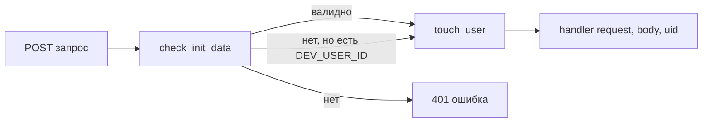

# 🔐 Авторизация

Как сервер понимает, кто прислал запрос ([строки 340–369, 635–645](../bot/main.py)). Зависит от `BOT_TOKEN` из [[Конфиг и запуск]].

## Проверка подписи Telegram

`check_init_data(raw)` ([строка 342](../bot/main.py)):
1. Разбирает строку `initData` (её даёт Telegram Mini App).
2. Считает HMAC-SHA256 от данных, ключ выведен из `BOT_TOKEN`.
3. Сверяет с присланным `hash` через `hmac.compare_digest`.
4. Проверяет, что подпись не старше суток (`auth_date`).
5. Возвращает `dict` пользователя Telegram или `None`.

> [!info] Зачем
> Гарантирует, что запрос реально пришёл из Telegram от конкретного человека, а не подделан. Без валидной подписи в API не пускают.

## Декоратор `@auth` — привратник всех эндпоинтов

`auth(handler)` ([строка 635](../bot/main.py)) оборачивает **каждый** `/api/...`:

Поэтому все хендлеры имеют сигнатуру `(request, body, uid)` — `uid` уже проверен и готов.

> [!danger] DEV-лазейка
> Если `DEV_USER_ID` задан, невалидная подпись подменяется этим юзером. Удобно локально, **смертельно на проде** — впустит кого угодно. На проде переменную не задавать.

## `touch_user(tg_user)`

При каждом входе обновляет `username` и `photo` в таблице `users` (или создаёт запись). Так профиль всегда свежий.

Связано: [[API-эндпоинты]], [[boot_payload — сборка ответа]].
