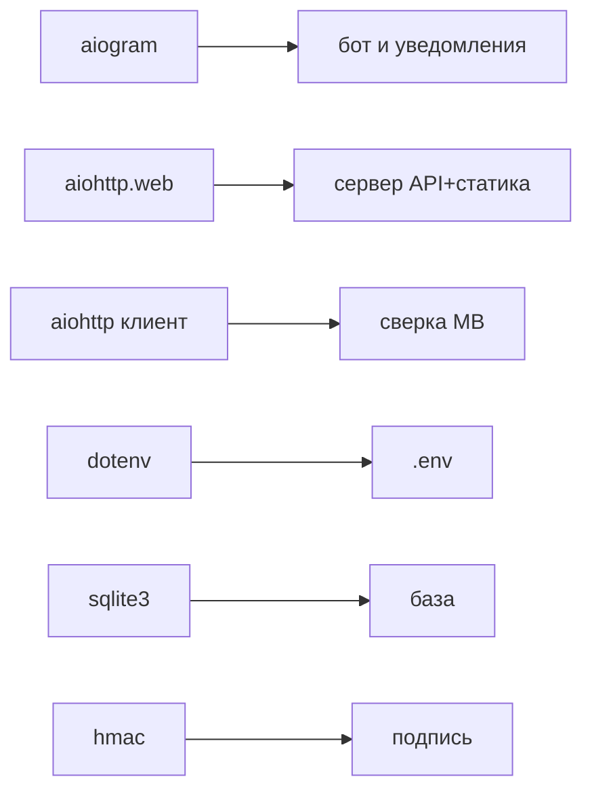

# 📦 Внешние зависимости

Что импортируется в начале `main.py` ([строки 14–42](../bot/main.py)) и зачем. Устанавливать нужно только два пакета: `aiogram` и `aiohttp` (+ `python-dotenv`). Остальное — стандартная библиотека Python.

## Сторонние пакеты (ставить через pip)

> [!info] aiogram 3
> `from aiogram import Bot, Dispatcher, F` + `filters`, `types`.
> Это **сам Telegram-бот**: приём `/start`, отправка уведомлений в личку, карточки в канал, кнопка Mini App, media-group с фото.
> Ключевые объекты: `Bot` (глобальная переменная `bot`), `Dispatcher` (`dp`), `BufferedInputFile` (фото из памяти без диска), `InlineKeyboardMarkup`/`WebAppInfo` (кнопки).
> Связано с: [[Уведомления и карточки]].

> [!info] aiohttp
> `from aiohttp import web` — **HTTP-сервер**: раздаёт `prototype/` и принимает `/api/...`.
> `import aiohttp` (клиент) — **скачивает** Google-CSV со списком MB (`mb_members()`).
> Значит aiohttp работает в двух ролях: сервер И клиент.
> Связано с: [[API-эндпоинты]], [[Каталог и занятость]].

> [!info] python-dotenv
> `from dotenv import load_dotenv` — читает `bot/.env` в переменные окружения при старте.
> Связано с: [[Конфиг и запуск]].

## Стандартная библиотека (ничего ставить не надо)

| Модуль | Зачем в проекте |
|---|---|
| `sqlite3` | Вся база (`bot/oborudka.db`). См. [[Слой БД]] |
| `asyncio` | Асинхронность, `scheduler_loop`, `main()` |
| `hashlib` + `hmac` | Проверка подписи Telegram. См. [[Авторизация]] |
| `json` | Сериализация в БД (items, history, orgs) и ответы фронту |
| `csv` + `io` | Выгрузка `api_export` в CSV в память |
| `datetime` + `time` | Время, таймзона `MSK` (+3), дедлайны |
| `pathlib.Path` | Пути к файлам (`BASE`, `WEBAPP_DIR`, `DB_PATH`) |
| `os` | Чтение переменных окружения |
| `shutil` | Копия базы для `weekly_backup` |
| `logging` | Логи (`log`) |
| `urllib.parse.parse_qsl` | Разбор `initData` в проверке подписи |
| `base64` | Декод фото (импорт внутри `_decode_photos`) |

> [!warning] Python 3.8
> На VPS заказчика Python **3.8**. Синтаксис 3.9+ (`str.removeprefix`, `dict1 | dict2` для типов, `Path.is_relative_to`) НЕ использовать. Код уже написан под 3.8.

## Схема зависимостей от библиотек

Дальше → [[Конфиг и запуск]].
