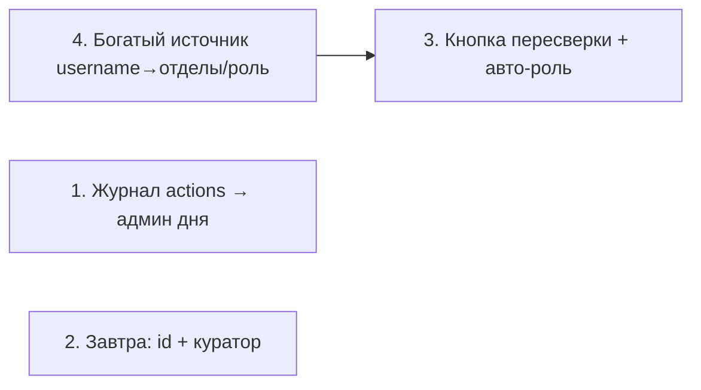

# 🛠️ Гайд — 4 правки (что менять + промт для нейронки)

Четыре задачи. По каждой: **что и где менять** + **готовый промт**, который можно вставить нейронке-ассистенту (Claude Code / Cursor и т.п.), чтобы она сделала правку.

> [!info] Как пользоваться
> 1. Прочитай «что менять» — поймёшь суть и подводные камни.
> 2. Скопируй блок «Промт» вместе с общей преамбулой ниже и дай ассистенту.
> 3. После правки: `bot/main.py` → **перезапуск бота**; `prototype/*` → просто обнови страницу.

## 🧩 Общая преамбула (добавлять к каждому промту)

```
Проект «Оборудыш» — Telegram Mini App. Бэкенд — один файл bot/main.py
(aiohttp + aiogram 3 + SQLite), фронт — один файл prototype/index.html (vanilla JS).
Ограничения и правила:
- Python 3.8 (на VPS): без синтаксиса 3.9+ (никаких str.removeprefix, Path.is_relative_to, X|Y в аннотациях).
- Каждый мутирующий @auth-эндпоинт заканчивается: return web.json_response(boot_payload(uid)).
- Новую таблицу/колонку заводить в init_db() И дублировать в _migrate() (иначе прод-база упадёт).
- Роут регистрируется в main() через app.router.add_post(...).
- Уведомления: notify(uid, text), notify_seniors(text). Время: now_str() -> "%d.%m, %H:%M", таймзона MSK.
- Токены/секреты не трогать и не писать в код.
- Сохраняй стиль соседнего кода. Покажи точные диффы по функциям.
```

---

## 1️⃣ Админ дня в сводке (кто сделал больше всех за день)

> [!warning] Главная проблема
> Сейчас **нет журнала действий**: `_push_hist` пишет в историю заявки только `[статус, время]` — БЕЗ id админа и без года. Посчитать «кто сделал больше за день» из этого нельзя. Нужен отдельный лог действий.

**Что менять (`bot/main.py`):**
1. Новая таблица `actions(id, admin_id, kind, ref, action, ts REAL)` — в `init_db()` + `_migrate()` (см. [[Слой БД]]).
2. Логировать в `api_req_action` и `api_626_action`: в ветках админских действий (`curator`/`approved`/`issue`/`return`/`closed`/…) добавить `INSERT INTO actions`.
3. В `daily_digest()` ([[Планировщик]]): выбрать действия за сегодня (`ts` в пределах суток), сгруппировать по `admin_id`, взять топ-1, дописать строку `• Админ дня: <имя> (N действий)`.

> [!tip] Имя админа — через `_disp_user(admin_id)`.

**Промт:**
```
Добавь «админа дня» в ежедневную сводку.
1) Заведи таблицу actions(id INTEGER PK AUTOINCREMENT, admin_id INTEGER, kind TEXT, ref INTEGER,
   action TEXT, ts REAL) в init_db() и продублируй создание в _migrate() (через отдельный
   CREATE TABLE IF NOT EXISTS, т.к. _migrate сейчас только ALTER — добавь туда безопасное создание таблицы).
2) В api_req_action и api_626_action во всех ветках, где действие делает админ/старший
   (is_admin(uid)/is_senior(uid)), после успешного UPDATE вставляй:
   INSERT INTO actions(admin_id, kind, ref, action, ts) VALUES(uid, 'req'|'626', rid|bid, action, time.time()).
3) В daily_digest() посчитай за текущие сутки (MSK) действия по admin_id, возьми лидера и добавь
   в текст сводки строку: "• Админ дня: <_disp_user(id)> — N действий". Если действий за день нет — строку пропусти.
Соблюдай Python 3.8 и общую преамбулу.
```

---

## 2️⃣ В сводке перечислять заявки на завтра (номер + куратор)

**Что менять (`bot/main.py`, только `daily_digest()`):**
Сейчас есть счётчики `give` (выдачи завтра) и `back` (возвраты завтра) — просто числа. Заменить/дополнить: выбрать сами заявки с `id` и `curator` и перечислить.

- Выдачи завтра: `SELECT id, curator FROM requests WHERE status='approved' AND dfrom_iso=?` (tomorrow).
- Возвраты завтра: `SELECT id, curator FROM requests WHERE status='issued' AND dto_iso=?` (tomorrow).
- Формат строки на каждую: `ID 266 — куратор @Kyuller`.

**Промт:**
```
В daily_digest() (bot/main.py) вместо простых чисел give/back выведи списки заявок на завтра.
Выдачи завтра: SELECT id, curator FROM requests WHERE status='approved' AND dfrom_iso=<tomorrow>.
Возвраты завтра: SELECT id, curator FROM requests WHERE status='issued' AND dto_iso=<tomorrow>.
В тексте сводки под строкой про завтра добавь два блока:
"Завтра выдать:" и на каждой строке "  • ID <id> — куратор <_disp_user(curator) или 'без куратора'>";
аналогично "Завтра принять:". Если список пуст — пиши "— нет". Не ломай остальные строки сводки.
Python 3.8, общая преамбула.
```

---

## 3️⃣ Кнопка «Обновить БД / пересверить людей»

Старший жмёт кнопку → бот заново сверяет всех со списками. Правила:
- пропал из списка → `verified='pending'` (старший подтверждает заново) + уведомить старших;
- роль поменялась в источнике → обновить автоматически.

> [!warning] Зависимость
> Авто-обновление роли работает, только если **источник знает роль** человека. Сейчас списки хранят лишь ФИО (см. [[Данные — каталог и списки]]). Пока не сделана [[#4️⃣ Автозаполнение отделов и роли по нику ТГ|Задача 4]], пересверка сможет только вернуть пропавших в `pending`; роль обновлять будет нечем. Делать в порядке: сначала 4, потом «роль» в 3.

**Что менять:**
- `bot/main.py`: новый эндпоинт `@auth async def api_resync(...)` (только `is_senior`). Пройти `SELECT * FROM users WHERE agreed=1`, для каждого пересверить `mb_ok`/`org_ok` (как в `api_register`). Если был `ok`, а теперь не найден → `verified='pending'`, уведомление старшим. Вернуть `boot_payload(uid)`. Роут в `main()`.
- `prototype/index.html`: кнопка в `seniorHub` ([[Фронтенд — экраны]]) → `srvDo("resync")`, тост со сводкой (сколько отправлено на перепроверку).

**Промт:**
```
Добавь эндпоинт пересверки пользователей.
Бэк (bot/main.py):
- @auth async def api_resync(request, body, uid): только для is_senior(uid), иначе jerr(403).
  Пройди по SELECT * FROM users WHERE agreed=1. Для каждого определи mb = "Media BMSTU" in orgs,
  found = await mb_ok(name) if mb else org_ok(name). Если пользователь был verified='ok', а found=False —
  переведи в verified='pending' и запомни. По окончании: notify_seniors со списком «отправлены на перепроверку: ...»
  (если кто-то был). Верни web.json_response(boot_payload(uid)), добавив в ответ поле resynced=<кол-во>.
- Зарегистрируй роут app.router.add_post("/api/resync", api_resync) в main().
Фронт (prototype/index.html):
- В экране seniorHub добавь кнопку «Обновить БД (пересверить людей)», вызывающую
  srvDo("resync", {}, ()=>toast("Отправлено на перепроверку: "+(SRV.resynced||0))).
Python 3.8, общая преамбула. Роль пока НЕ обновляй — это отдельная задача.
```

---

## 4️⃣ Автозаполнение отделов и роли по нику ТГ

Бот берёт `username` из Telegram, ищет человека в таблице и подставляет **все его отделы** и **статус/роль** автоматически.

> [!danger] Нужен богатый источник данных
> Сейчас парсер (`make_members.py`) выписывает **только ФИО**. Чтобы подставлять отделы и роль по нику, таблица-источник должна содержать колонки: `username`, `ФИО`, `отделы`, `роль`. Без этого задачу не сделать. Значит правка из двух частей: (а) новый формат источника + парсер, (б) чтение в боте.

**Что менять:**
1. **Источник + парсер** (`bot/make_members.py` или новый скрипт): выгружать `directory.csv` со столбцами `username;name;departments;role` (departments — через запятую). Google-таблица MB тоже должна получить эти колонки.
2. **Загрузчик** (`bot/main.py`): функция `directory()` → dict, ключи — нормализованный `username` (без @) и/или ФИО, значения `{name, deps:[...], role}`. Кэш по mtime, как `org_members()`.
3. **Подстановка**: в `api_register` (и/или `touch_user`) — если нашли по `username` (берётся из initData, уже сохраняется в `users.username`), заполнить `deps` всеми отделами из справочника и `role` из справочника.
4. Это же питает авто-обновление роли в [[#3️⃣ Кнопка «Обновить БД / пересверить людей»|Задаче 3]].

**Промт:**
```
Сделай автозаполнение отделов и роли по Telegram-нику.
Часть А — источник: доработай bot/make_members.py (или сделай bot/make_directory.py), чтобы он писал
bot/directory.csv со столбцами username;name;departments;role (departments — несколько через запятую).
Часть Б — бэк (bot/main.py):
- Добавь loader directory() по образцу org_members(): читает DIRECTORY_FILE (новая env, дефолт bot/directory.csv),
  возвращает dict, ключ — username в нижнем регистре без «@», значение {name, deps:[...], role}. Кэш по mtime. Нет файла — None.
- В api_register: если у пользователя есть username (он уже в users.username), найди его в directory();
  если нашёл — подставь deps = все отделы из справочника, role = роль из справочника (перекрывая выбранные),
  и считай mb-верификацию пройденной, если запись есть в справочнике.
- Учитывай, что username может отсутствовать — тогда работай как раньше (по ФИО).
Python 3.8, общая преамбула. Не удаляй старую сверку по ФИО — добавляй рядом.
```

---

## Порядок выполнения



Задачи 1 и 2 независимы — можно делать сразу. Задача 3 «роль» опирается на 4 — сначала источник, потом пересверка.

Связано: [[Планировщик]], [[API-эндпоинты]], [[Слой БД]], [[Данные — каталог и списки]], [[Гайд — куда развивать]].
