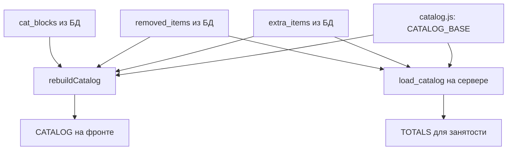

# 🗂️ Данные — каталог и списки

Файлы-данные, которые бот и фронт читают, но которые генерятся отдельно (парсерами/скриптами). Их надо не забывать переносить на прод.

## `prototype/catalog.js` — каталог оборудования

Формат — один глобальный массив:

```js
window.OBORUDKA_CATALOG = [
  { "cat": "Камеры", "items": [
    { "short": "а7м4", "full": "Фотоаппарат Sony Alpha ILCE-7M4 Body", "total": 1, "level": "акт" },
    { "short": "R8",   "full": "Фотоаппарат Canon EOS R8 body",        "total": 2, "level": null },
    ...
  ]},
  ...
];
```

| Поле | Смысл |
|---|---|
| `cat` | категория (группа) |
| `short` | короткое имя — **ключ везде**: корзина, `TOTALS`, имя файла фото |
| `full` | полное название |
| `total` | сколько единиц всего (для занятости) |
| `level` | `"акт"` (активисты/production), `"глава"` (только старшие), `null` (всем) |

> [!important] `short` — это первичный ключ
> По `short` строится корзина, считается занятость (`TOTALS`), ищется фото (`img/<short>.avif`). Переименуешь `short` — «потеряются» старые заявки с этим именем и файл фото. Регистр и пробелы критичны.

Кто читает: фронт ([[Фронтенд — каталог, мастер, фото]] — `CATALOG_BASE`) **и** сервер ([[Каталог и занятость]] — `load_catalog` → `TOTALS`). Один файл на двоих.

> [!warning] Деплой
> Обновил каталог парсером → **перенеси `catalog.js` на сервер** вместе с фронтом. Иначе занятость на сервере посчитается по старому набору.

## `bot/org_members.csv` — список для сверки организаций

- Генерит `bot/make_members.py` из Excel: `python make_members.py "файл.xlsx" [лист]`.
- Выписывает все ячейки из ≥2 слов (похоже на ФИО), повторы схлопывает, пишет в `org_members.csv`.
- Читает бот через `ORG_MEMBERS_FILE` → `org_ok()` в [[Каталог и занятость]]. Кэш обновляется по времени изменения файла (перегенерил — подхватится сам).
- Нужен `pip install openpyxl` (разово).

## Список Media BMSTU — Google-таблица

- Не файл, а URL (`MB_SHEET_URL`) на опубликованный CSV листа «список ребят».
- Бот тянет его (`mb_members()`), кэш 10 мин, сверяет ФИО при регистрации (`mb_ok()`).
- Пусто → сверка MB выключена (все MB — авто-ok).

## Фото позиций — `prototype/img/<short>.avif`

- Имя файла = `short` из каталога **буква-в-букву** (`img/Сони а7м4.avif`).
- Нет файла → фронт показывает SVG-иконку категории (фолбэк уже работает).
- Свести имена файлов с каталогом помогает промт [prompt-catalog-table.md](../prompt-catalog-table.md).

## Как каталог собирается в рантайме



Связано: [[Каталог и занятость]], [[Слой БД]], [[Гайд — куда развивать]].
