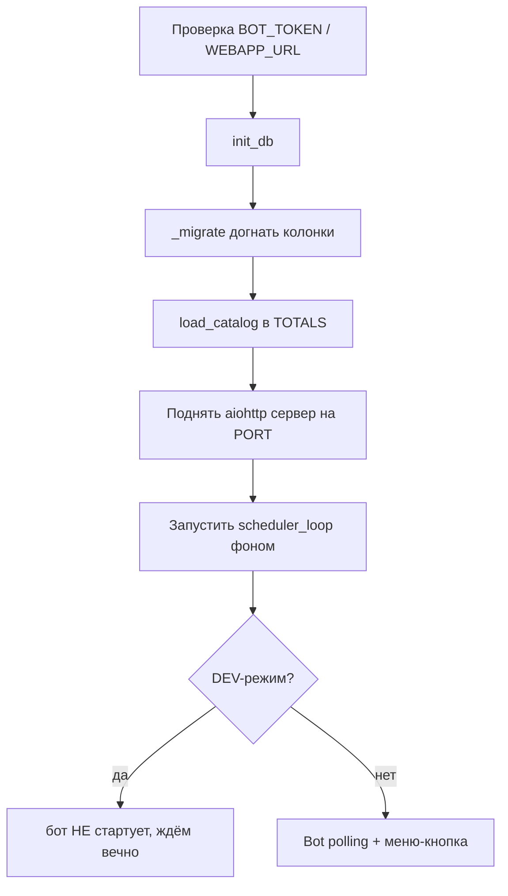

# ⚙️ Конфиг и запуск

Переменные из `.env` ([строки 44–69](../bot/main.py)) — верхний слой, от которого зависит всё остальное. Читаются один раз при старте через `load_dotenv`.

## Переменные .env

| Переменная | Что | Где используется |
|---|---|---|
| `BOT_TOKEN` | токен бота | подпись ([[Авторизация]]), запуск бота |
| `WEBAPP_URL` | https-адрес Mini App | кнопка приложения |
| `PORT` | порт сервера (8737) | `main()` |
| `ADMIN_CHAT_ID` | id канала для карточек | [[Уведомления и карточки]] |
| `ADMIN_IDS` | личные id админов | `is_admin()` |
| `SENIOR_ADMIN_IDS` | личные id старших | `is_senior()` |
| `DEV_USER_ID` | локальный тест без TG | декоратор `@auth` |
| `MB_SHEET_URL` | CSV списка Media BMSTU | `mb_members()` |
| `ORG_MEMBERS_FILE` | файл списка организаций | `org_members()` |

> [!danger] Безопасность
> `DEV_USER_ID` на проде **НЕ задавать** — он пускает в API без проверки подписи (любой запрос = этот юзер).
> В `ADMIN_IDS`/`SENIOR_ADMIN_IDS` — **личные** id людей, не id чатов. Иначе уведомления о верификации летят в общий чат (в `main()` есть warning на отрицательные id).

## Роли доступа (чистые функции)

- `is_senior(uid)` → uid в `SENIOR_ADMIN_IDS`.
- `is_admin(uid)` → uid в `ADMIN_IDS` **или** `SENIOR_ADMIN_IDS`.
- Значит: **старший ⊇ админ**. Старший всегда может всё, что админ.

## Порядок запуска `main()` ([строка 1647](../bot/main.py))

- **DEV-режим** = `DEV_USER_ID` задан И `BOT_TOKEN` пуст. Бот=None, `notify`/фото — no-op. Для локальных тестов.
- Все роуты регистрируются в `main()` ([строки 1665–1690](../bot/main.py)). **Новый эндпоинт → добавить `app.router.add_post` сюда.**
- `client_max_size=32*1024*1024` — 32 МБ на тело запроса (иначе base64-фото не влезут).

Дальше → [[Слой БД]].
