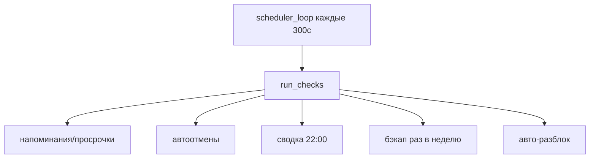

# ⏱️ Планировщик

Фоновая задача, крутится всё время параллельно с ботом ([строки 1420–1592](../bot/main.py)). Запускается в `main()` как `scheduler_loop`. Зависит от [[Слой БД]] и [[Уведомления и карточки]].

## Цикл

`scheduler_loop()` → каждые **300 сек** (`asyncio.sleep(300)`) вызывает `run_checks()`. Ошибка внутри — логируется, цикл не падает.

> [!tip] Хочешь чаще/реже
> Меняй `asyncio.sleep(300)` в `scheduler_loop` ([строка 1584](../bot/main.py)).

## Что делает `run_checks()` ([строка 1482](../bot/main.py))

| Проверка | Условие | Действие |
|---|---|---|
| Напоминание о сдаче | issued, до дедлайна < 1ч | юзеру «через час срок» |
| Просрочка | issued, дедлайн прошёл | юзеру, раз в 2ч |
| Зависла без куратора | new, > 6ч | в канал, раз в 6ч |
| Зависла у куратора | curator, > 6ч | в канал, раз в 6ч |
| **Автоотмена** | new/curator > 3 дней | → canceled |
| **Автоотмена** | approved, срок получения прошёл | → canceled |
| 626 сдать | approved, слот кончился | юзеру напоминание |
| 626 без согласования | new, > 6ч | в канал |
| **Сводка** | час ≥ 22, раз в день | `daily_digest` в канал |
| **Бэкап** | раз в неделю | `weekly_backup` (храним 3) |
| Авто-снятие блоков | срок истёк | юзеры + категории → разблок |

## Антиспам через поле `notif`

Чтобы не слать одно и то же каждые 5 минут, в заявке есть JSON-поле `notif`. Помощники:
- `_get_notif` / `_set_notif` — читать/писать этот словарь.
- Ключи-флаги: `pre` (напомнили о сдаче), `over` (когда последний раз про просрочку), `nocur`, `noappr`, `handover`.

Сводка и бэкап гейтятся через таблицу `meta` (`digest_date`, `backup_date`) — «уже делал сегодня/на этой неделе».

## Тест локально

`api_dev_tick` ([строка 1587](../bot/main.py)) — ручной прогон `run_checks()`, работает **только в DEV** (`POST /api/dev/tick`). На проде — 404.

Связано: [[Поток заявки]], [[API-эндпоинты]].
