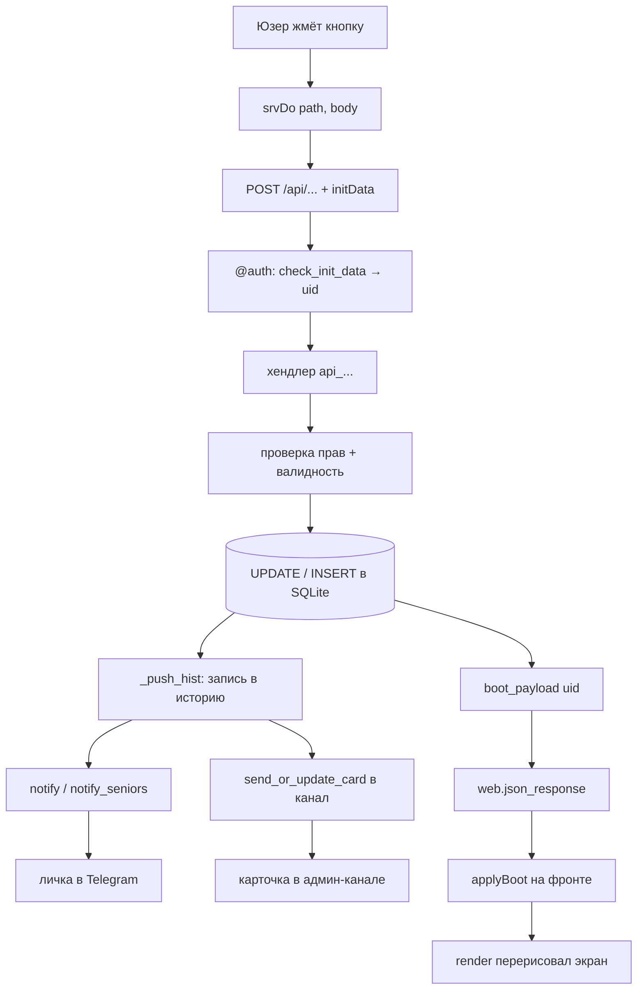
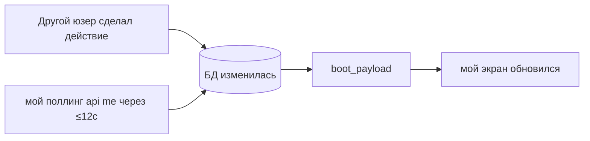

# 🔁 Полный цикл: фронт → API → БД → уведомление

Одна большая схема — как одно нажатие проходит через весь стек и возвращается. Пример: **куратор согласует заявку**.

## Общий цикл (любое действие)

## Тот же путь по слоям

| Шаг | Где | Заметка |
|---|---|---|
| 1. клик | `SCREENS.adminReq` | [[Фронтенд — экраны]] |
| 2. `srvDo("request/action", {id, action:"approved"})` | `index.html` | [[Фронтенд — режимы и запуск]] |
| 3. проверка подписи | `@auth` → `check_init_data` | [[Авторизация]] |
| 4. хендлер | `api_req_action`, ветка `approved` | [[API-эндпоинты]] |
| 5. запись | `UPDATE requests SET status='approved'` | [[Слой БД]] |
| 6. история | `_push_hist` | [[Поток заявки]] |
| 7. уведомление владельцу | `notify(owner, ...)` | [[Уведомления и карточки]] |
| 8. карточка в канал | `send_or_update_card` | [[Уведомления и карточки]] |
| 9. свежий снимок | `boot_payload(uid)` | [[boot_payload — сборка ответа]] |
| 10. перерисовка | `applyBoot` → `render` | [[Фронтенд — навигация и render]] |

> [!important] Два «выхода» у каждого действия
> 1. **Ответ инициатору** — всегда `boot_payload` (фронт сразу видит новое состояние).
> 2. **Побочные уведомления** — `notify`/карточка/фото другим участникам (владелец, куратор, канал, старшие).

## Второй канал обновления — поллинг

Действия других людей инициатор не видит мгновенно. Их подтягивает **поллинг** ([[Фронтенд — режимы и запуск]]): каждые 12 сек `api("me")` → тот же `boot_payload` → перерисовка, если что-то изменилось.

## Третий канал — фон без запроса

[[Планировщик]] (`run_checks` каждые 5 мин) шлёт уведомления/автоотмены **сам**, без действий юзера: напоминания о сдаче, просрочки, сводка 22:00, авто-снятие блоков.

Общий индекс — [[00 Карта бота]].
