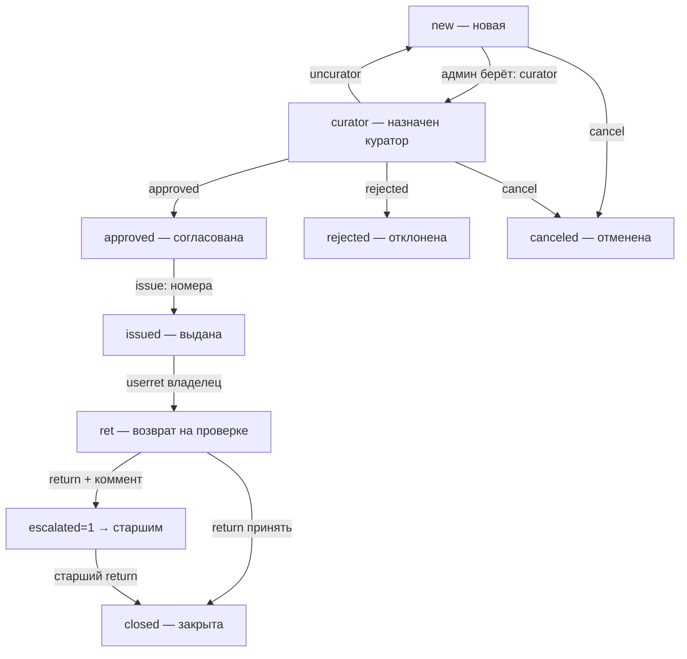

# 🔄 Поток заявки (жизненный цикл)

Как заявка на оборудование ходит по статусам. Логика в `api_req_action` из [[API-эндпоинты]]. Статус хранится в `requests.status` ([[Слой БД]]).

## Статусы

## Кто что может

| Переход | Кто | action |
|---|---|---|
| new → curator | админ | `curator` |
| curator → new | тот же куратор | `uncurator` (снять себя) |
| curator → approved | админ | `approved` |
| curator → rejected | админ | `rejected` (с причиной) |
| approved → issued | админ | `issue` (номера экземпляров) |
| issued → ret | владелец | `userret` (+ фото) |
| ret → closed | админ/старший | `return` |
| ret → эскалация | не-старший + коммент | `return` + comment |
| * → canceled | владелец, до согласования | `cancel` |

## Важные детали

> [!important] Эскалация проблемного возврата
> Куратор видит проблему при приёме → пишет комментарий в `return`. Заявка получает `escalated=1`, уходит старшим в отдельную вкладку. Куратор больше не принимает. **Сам старший эскалировать не может** (проверка `not is_senior(uid)`).

> [!note] Снятие кураторства (`uncurator`)
> До выдачи (curator/approved) — заявка возвращается в очередь (`status='new'`, `curator=NULL`). После выдачи — просто освобождает кураторство, статус не откатывает.

> [!note] Выдача (`issue`)
> Админ может убрать/добавить позиции (нет в наличии) — новый состав в `body["items"]`. Номера экземпляров (`nums`) видит только админ, юзеру не показываются.

> [!warning] Автоотмены
> [[Планировщик]] сам отменяет: new/curator старше 3 дней, approved с прошедшим сроком получения. Оборудование освобождается.

## Занятость

Пока заявка в `ACTIVE_STS` (new/curator/approved/issued/ret) — она **держит** оборудование на свои даты. См. [[Каталог и занятость]].

Студия 626 — похожий, но короче цикл: `new → approved → ret → closed` (согласуют только старшие). См. `api_626_action`.
