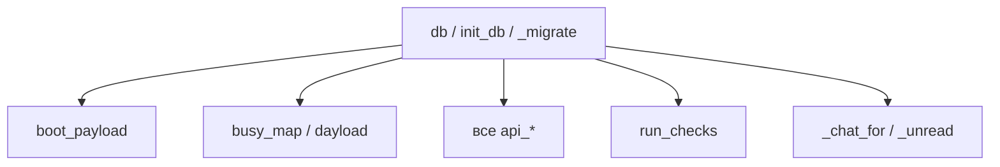

# 🗄️ Слой БД

SQLite в файле `bot/oborudka.db`. Основа ([строки 72–137](../bot/main.py)). От этого слоя зависят почти все остальные — любой запрос идёт через `db()`.

## Три функции-фундамента

> [!note] `db()`
> Открывает коннект, ставит `row_factory = sqlite3.Row` (доступ к колонкам по имени: `r["status"]`). Используется через `with db() as c:` везде.

> [!note] `init_db()`
> `CREATE TABLE IF NOT EXISTS ...` для всех таблиц. Вызывается в `main()` при каждом старте. Безопасно на существующей базе.

> [!warning] `_migrate()`
> Догоняет **новые колонки** на старых базах через `ALTER TABLE`. Словарь `adds` = {таблица: {колонка: тип}}.
> **Добавил колонку в `init_db` → обязательно впиши её и в `adds`**, иначе у заказчика на старой базе колонки не будет и код упадёт. Это самая частая ловушка.

## Таблицы

| Таблица | Ключевые колонки | Заметка |
|---|---|---|
| `users` | id, name, orgs, deps, role, verified, block_until | верификация, роли |
| `requests` | items, status, curator, dfrom_iso/dto_iso, escalated, notif | [[Поток заявки]] |
| `b626` | day, slot, goal, needs, status, curator | брони студии |
| `messages` | kind, ref, sender, text, role | [[boot_payload — сборка ответа]] чат |
| `extra_items` | cat, short, total, level | добавленная оборудка |
| `removed_items` | short | скрытая оборудка |
| `cat_blocks` | cat, until | блок категорий (авто-снятие) |
| `fav_sets` | user_id, name, items | избранные наборы |
| `reads` | user_id, kind, ref, seen | непрочитанное (бейджи) |
| `meta` | k, v | флаги digest_date / backup_date |

## Как хранятся списки

Списки и объекты кладутся в TEXT-колонки как **JSON-строки**: `items`, `history`, `orgs`, `deps`, `needs`, `notif`. Значит на чтении почти всегда `json.loads(r["items"])`, на записи — `json.dumps(..., ensure_ascii=False)` (кириллица без экранирования).

## Кто зависит от БД

Дальше → [[Каталог и занятость]] или [[boot_payload — сборка ответа]].
