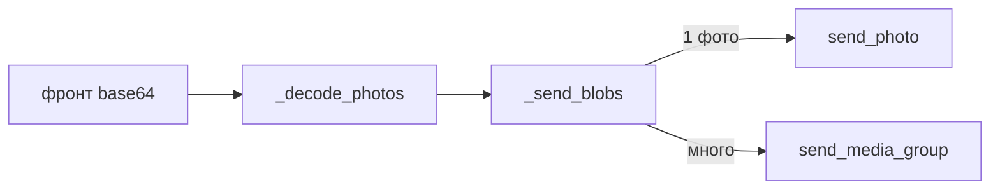

# 🔔 Уведомления и карточки

Как бот пишет людям в личку и в админ-канал ([строки 529–627, 648–685](../bot/main.py)). Зависит от `aiogram` ([[Внешние зависимости]]) и `ADMIN_CHAT_ID` из [[Конфиг и запуск]].

## Личные уведомления

- `notify(uid, text)` — сообщение одному человеку в личку. Бот=None (DEV) → тихо ничего.
- `notify_seniors(text)` — всем из `SENIOR_ADMIN_IDS`.

Используются во всех эндпоинтах при смене статуса: «заявка согласована», «назначен куратор» и т.д.

## Карточки в канал

> [!note] `send_or_update_card(table, row)`
> Одна карточка на заявку в `ADMIN_CHAT_ID`. Первый раз — создаёт (`send_message`, id сохраняется в `admin_msg`). Дальше — **редактирует** то же сообщение (`edit_message_text`). Так канал не засоряется.

- `req_card_text(r)` / `b626_card_text(b)` — формируют текст карточки.
- `ST_LABEL` — словарь русских названий статусов. **Меняешь текст статуса → здесь.**
- `deeplink_kb()` — кнопка «Открыть в приложении» (в каналах web_app-кнопки нельзя, только t.me-ссылка).

## Фото без диска

> [!important] Фото не хранятся на сервере
> Фронт шлёт фото как base64. Путь: `_decode_photos` (base64 → bytes, лимит 4 МБ/фото) → `send_photos_b64` → `_send_blobs` (`BufferedInputFile` → прямо в Telegram, media-group одним сообщением). На диск ничего не пишется.

Куда шлются фото: куратору в личку + в `ADMIN_CHAT_ID` (сдача заявки/626, обращение).

> [!warning] Nginx на проде
> Для фото нужен `client_max_body_size 32M` в Nginx, иначе 413. В самом aiohttp лимит уже поднят (`client_max_size=32МБ`).

Связано: [[API-эндпоинты]], [[Планировщик]] (сводки тоже через уведомления).
