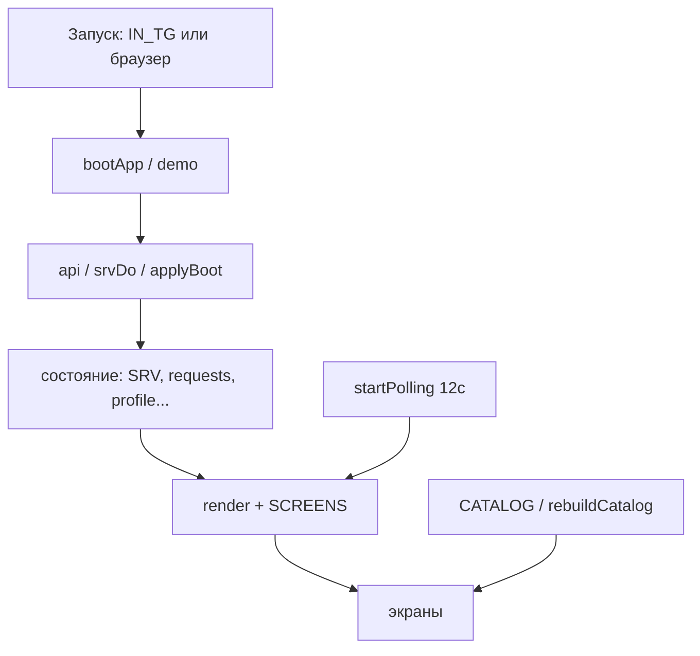

# 🖥️ Фронтенд — карта (`prototype/index.html`)

**Весь фронт — один файл** `prototype/index.html` (~2428 строк): vanilla JS + CSS, без сборки и фреймворков. Плюс необязательный `prototype/catalog.js` (каталог). Точка входа во фронтенд-заметки.

> [!important] Два режима одного файла
> - **Браузер** = кликабельное демо на моках. `SRV = null`, данные из заранее вписанных массивов.
> - **Внутри Telegram** (`IN_TG`) = боевой клиент к API. `SRV` = ответ бэкенда, моки очищаются.
> Определяется в самом начале: `IN_TG = !!(TG && TG.platform && TG.platform !== "unknown")`.

## Устройство (снизу вверх)

## Заметки фронтенда

- [[Фронтенд — режимы и запуск]] — SRV vs моки, `IN_TG`, `bootApp`, поллинг, тема.
- [[Фронтенд — навигация и render]] — `stack`, `SCREENS`, `render()`, сохранение скролла/ввода.
- [[Фронтенд — экраны]] — таблица всех `SCREENS.*` и что где.
- [[Фронтенд — каталог, мастер, фото]] — каталог, мастер заявки, сжатие фото, доступы.
- [[Фронтенд — стили и токены]] — CSS-токены, тёмная тема, ловушки.

## Связь с бэкендом

Каждый экран, меняющий данные, зовёт `srvDo('/endpoint', body)` → сервер отвечает [[boot_payload — сборка ответа]] → `applyBoot` перерисовывает. То есть фронт почти не хранит логику статусов — он рисует то, что прислал [[API-эндпоинты|сервер]].

> [!tip] Правки фронта не требуют перезапуска
> `prototype/*` раздаётся как статика ([[Конфиг и запуск]] → `serve_static`). Меняешь HTML/JS — просто обнови страницу. Перезапуск нужен только для `bot/main.py`.

Общий индекс — [[00 Карта бота]].
