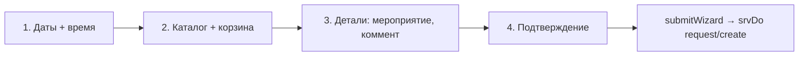

# 🧰 Фронтенд — каталог, мастер, фото

Три самых «мясистых» куска фронта.

## Каталог ([строки 388–455](../prototype/index.html))

- `CATALOG_BASE` = `window.OBORUDKA_CATALOG` (из `prototype/catalog.js`) **или** встроенный демо-набор. Неизменяем.
- `let CATALOG` — пересобирается в `rebuildCatalog(extraItems, catBlocks, removedItems)` при каждом `applyBoot`:
  - добавляет `extra_items` (добавленное старшим),
  - убирает `removed_items` (скрытое),
  - вешает блокировки категорий (`catBlocks`).
- `catOf(short)` / `itemOf(short)` — найти категорию/позицию по короткому имени.

> [!important] Один каталог на фронт и сервер
> Тот же `catalog.js` читает и [[Каталог и занятость|бэкенд]] для `TOTALS`. Перенос `catalog.js` на сервер — обязательный шаг деплоя.

## Доступы к позициям ([строки 941–947](../prototype/index.html))

- `itemLocked(it)`:
  - уровень `глава` → только старшие (`isSeniorNow()`);
  - уровень `акт` → `canAct()` (активист / production / галочка «ответственный за медиа» на шаге 1);
  - без уровня → всем.
- **Кода/пароля больше нет** (вырезаны). Заблокированная категория просто рисуется недоступной.

## Мастер заявки (`wizard`, 4 шага)

Состояние в объекте `wiz`. `SCREENS.wizard` ([строка 949](../prototype/index.html)) роутит по шагу:

- **Шаг 1** — `wizDates()`: календарь `calHtml(cfg)` с подсветкой загрузки (`loadOf(iso)` → 🟢🟡🟠🔴), выбор диапазона `wizPick`, время-слоты.
  - `dateBlock()` — жёсткий запрет (воскресенье получить/вернуть).
  - `dateSoftWarn()` — мягкое предупреждение (сб после 18:00).
- **Шаг 2** — `wizCatalog()`: поиск, чипы категорий, степперы `chQty`, корзина `wiz.cart`. `kitWarnings()` — подсказки о комплекте. Избранные наборы: `saveFavSet`/`applyFavSet`.
- **Шаг 3** — `wizDetails()`: мероприятие, комментарий, галочки (медиа, ПВ).
- **Шаг 4** — `wizConfirm()` → `submitWizard()` → `srvDo("request/create", ...)`.

## Фото ([строки 1354–1404](../prototype/index.html))

- Массивы по назначению: `retPhotos` (сдача), `hoPhotos` (626), `appealPhotos` (вопрос), `bcPhotos` (рассылка) — выбираются через `photoArr(kind)`.
- `shrinkPhoto(file)` — **сжатие до 1024px, JPEG 0.65, в base64**. Так фото не раздувают запрос.
- `photosGrid(kind)` — сетка с добавлением/удалением (min 1, max 5).
- Base64 уходит на сервер, тот шлёт в Telegram media-group **без хранения на диске** ([[Уведомления и карточки]]).

> [!warning] Гард по размеру
> Есть проверка размера от ошибки 413. На проде нужен Nginx `client_max_body_size 32M`.

Связано: [[Фронтенд — экраны]], [[Каталог и занятость]].
