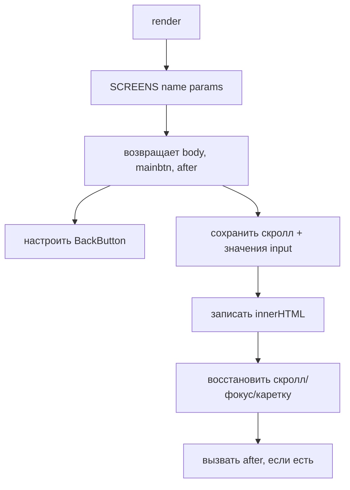

# 🧭 Фронтенд — навигация и render

Как переключаются экраны и как всё перерисовывается ([строки 541–615](../prototype/index.html)).

## Стек экранов

Навигация — **стек** объектов `{name, params}`:

| Функция | Что |
|---|---|
| `navTo(name, params)` | зайти вглубь (push) |
| `goBack()` | назад (pop) |
| `resetTo(name, params)` | сбросить стек на один экран |
| `cur()` | текущий экран (верх стека) |

`tgLeft()` — кнопка «‹ Назад»/«Закрыть»: в мастере откатывает шаг, иначе `goBack`, на корне — сворачивает Mini App.

## `render()` — сердце отрисовки ([строка 580](../prototype/index.html))

> [!important] Экран — это функция, возвращающая объект
> `SCREENS.имя = (params) => ({ body: "...html...", mainbtn: "...", after: fn })`.
> - `body` — HTML строкой.
> - `mainbtn` — нижняя кнопка (через `mainBtn(label, fn, cls, disabled)`).
> - `after` — колбэк после вставки в DOM (навесить обработчики, `markRead` и т.п.).

## Умное сохранение состояния при перерисовке

Ключ `_scrKey = name|глубина|шаг`. Если экран **тот же**:
- сохраняется позиция скролла (выбор дат/слотов не «прыгает»);
- сохраняются значения и фокус/каретка в полях с `id` (чат, комментарии, поиск не сбрасываются при поллинге).

Поэтому **любой `<input>`/`<textarea>`, который должен пережить перерисовку, обязан иметь `id`**.

## Помощники рендера

- `statusPill(st, dict)` — цветная пилюля статуса (`ST` для заявок, `ST626` для студии).
- `mainBtn(...)` — нижняя кнопка-пилюля.
- `itemsTitle(items)` — «R8 +2» (первая позиция + счётчик).
- `toast(txt)` — всплывашка.
- `escJs(s)` — экранирует строку для `onclick` (в названиях каталога есть кавычки!).

> [!warning] Ловушка onclick
> HTML собирается строками, обработчики — inline `onclick="fn('...')"`. Любую динамическую строку в `onclick` (особенно `short` из каталога) прогоняй через `escJs`, иначе кавычка сломает разметку.

Дальше → [[Фронтенд — экраны]].
