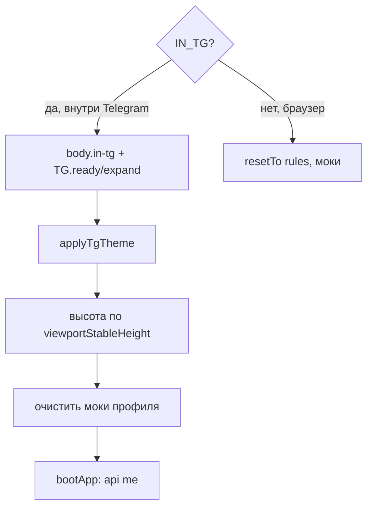

# 🚀 Фронтенд — режимы и запуск

Как страница стартует и откуда берёт данные. Низ файла `index.html` ([строки 2352–2424](../prototype/index.html)).

## Развилка запуска ([строка 2399](../prototype/index.html))

## `bootApp()` — вход в боевой режим ([строка 2362](../prototype/index.html))

1. `api("me")` → `applyBoot(d)` заливает данные.
2. `initCalSRV()` — календарь от реальной даты (текущий месяц + 2, через Новый год).
3. Выбор стартового экрана по статусу:

| Условие | Экран |
|---|---|
| `verified == "blocked"` | `blocked` |
| registered + `verified == "ok"` | `home` |
| registered + `pending` | `regWait` |
| registered + `rejected` | `rejected` |
| иначе | `rules` (онбординг) |

4. `startPolling()`.
5. Если бэкенд недоступен → `SRV = null`, падаем в демо, тост «Демо-режим».

## SRV vs моки

- `SRV` = последний ответ сервера. `null` = демо.
- `api(path, body)` ([строка 294](../prototype/index.html)) — `POST /api/<path>` с `initData`. Ошибка → бросает.
- `srvDo(path, body, after)` ([строка 302](../prototype/index.html)) — `api` + `applyBoot` + `after`. Флаг `_busy` глушит двойные клики.
- `applyBoot(d)` ([строка 321](../prototype/index.html)) — раскладывает ответ по глобалкам: `profile`, `requests`, `bookings626`, `verifQueue`, `usersDb`, `BUSY626`, `favSets`, и `rebuildCatalog`.

> [!tip] Тест SRV-режима в браузере
> Можно вручную вызвать `applyBoot({...фейковый payload...})` в консоли — фронт отрисует как боевой.

## Поллинг ([строка 2383](../prototype/index.html))

`startPolling()` — раз в **12 сек** тянет `api("me")`. Правила «не мешать»:
- пропуск, если открыт overlay (шторка/модалка);
- пропуск, если фокус в `input`/`textarea` (юзер печатает);
- перерисовка **только если данные изменились** (сравнение сигнатуры `_lastSig`), иначе экран не дёргается.

## Тема

- `applyTgTheme()` — берёт тему Telegram, но `localStorage["obor_theme"]` (ручной тумблер `userToggleTheme`) её **перебивает**.
- Классы `.dark` на `#phone`. Токены в [[Фронтенд — стили и токены]].

Дальше → [[Фронтенд — навигация и render]].
